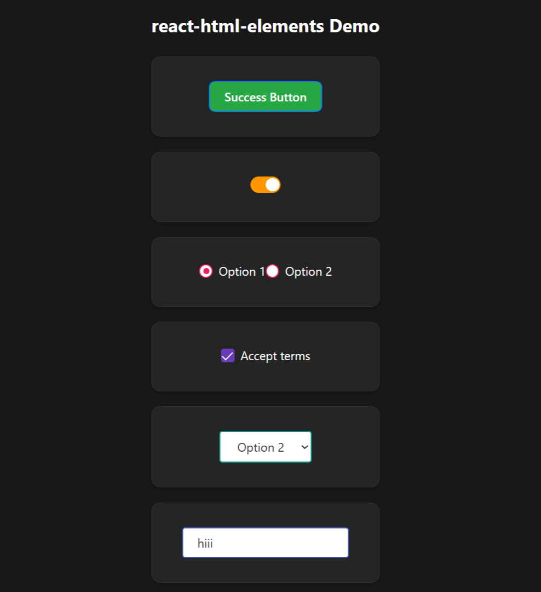

# react-html-elements

A standalone, dependency-free React component library for beautiful, customizable UI controls. Style every component with your own CSS or inline styles—no external libraries required!

## ✨ Features
- **Button**: Multiple variants, fully customizable
- **Toggle Switch**: Accessible, color and style support
- **Radio Button**: Custom design, flexible styling
- **Checkbox**: Modern, themeable
- **Dropdown**: Custom select, easy to style
- **Input Field**: All input types, style as you wish
- **No dependencies**: Only React and your CSS

> **Note:** All JavaScript, CSS, and type declaration files are now available at the package root after install. Import as shown below.

## 🚀 Installation

```bash
npm install react-html-elements
```

---

## 🖼️ SnapShot



---


## 🛠 Usage

Import only what you need:

```tsx
import { Button, ToggleSwitch, RadioButton, Checkbox, Dropdown, InputField } from 'react-html-elements';
```

And import the CSS for each component:

```js
import 'react-html-elements/button.css';
import 'react-html-elements/toggle-switch.css';
// ...etc
```

TypeScript types are also available automatically.

---

## 🎨 Dynamic Styling
- Pass any CSS property via the `style` prop to any component.
- Use CSS variables (e.g., `--rb-btn-color`, `--rb-toggle-color`) for theme colors.
- Add your own classes with the `className` prop for even more control.

---

## 🧑‍💻 Sample App Usage

```tsx
import React, { useState } from 'react';
import { Button, ToggleSwitch, RadioButton, Checkbox, Dropdown, InputField } from 'react-html-elements';
import 'react-html-elements/dist/button.css';
import 'react-html-elements/dist/toggle-switch.css';
import 'react-html-elements/dist/radio-button.css';
import 'react-html-elements/dist/checkbox.css';
import 'react-html-elements/dist/dropdown.css';
import 'react-html-elements/dist/input-field.css';

const options = [
  { label: 'Option 1', value: '1' },
  { label: 'Option 2', value: '2' },
  { label: 'Option 3', value: '3' },
];

function App() {
  const [toggle, setToggle] = useState(false);
  const [radio, setRadio] = useState('1');
  const [checked, setChecked] = useState(false);
  const [dropdown, setDropdown] = useState('');
  const [input, setInput] = useState('');

  return (
    <div style={{ padding: 32 }}>
      <h2>react-html-elements Demo</h2>
      <Button style={{ backgroundColor: '#28a745', color: '#fff', borderRadius: 8 }}>
        Success Button
      </Button>
      <br /><br />
      <ToggleSwitch
        checked={toggle}
        onChange={e => setToggle(e.target.checked)}
        style={{ '--rb-toggle-color': '#ff9800' }}
      />
      <br /><br />
      <RadioButton
        checked={radio === '1'}
        onChange={() => setRadio('1')}
        name="group"
        value="1"
        label="Option 1"
        style={{ '--rb-radio-color': '#e91e63' }}
      />
      <RadioButton
        checked={radio === '2'}
        onChange={() => setRadio('2')}
        name="group"
        value="2"
        label="Option 2"
        style={{ '--rb-radio-color': '#e91e63' }}
      />
      <br /><br />
      <Checkbox
        checked={checked}
        onChange={e => setChecked(e.target.checked)}
        label="Accept terms"
        style={{ '--rb-checkbox-color': '#673ab7' }}
      />
      <br /><br />
      <Dropdown
        options={options}
        value={dropdown}
        onChange={e => setDropdown(e.target.value)}
        placeholder="Select..."
        style={{ '--rb-dropdown-color': '#009688' }}
      />
      <br /><br />
      <InputField
        type="text"
        value={input}
        onChange={e => setInput(e.target.value)}
        placeholder="Type here..."
        style={{ '--rb-input-color': '#3f51b5' }}
      />
    </div>
  );
}

export default App;
```

---

## 🤝 Contributing
Pull requests and issues welcome! Please open an issue to discuss your idea before submitting a PR.

---

## 📄 License
MIT

---

## 👤 Author
**Akshay Bhalala**  
[akshaybhalala@gmail.com](mailto:akshaybhalala@gmail.com)

---


## 🏷️ Keywords
react, react-component, button, buttons, ui, ui-kit, toggle, switch, checkbox, radio, dropdown, input, custom-css, no-dependencies, typescript, accessible, themeable, styled, form, select, input-field, npm-package

---
